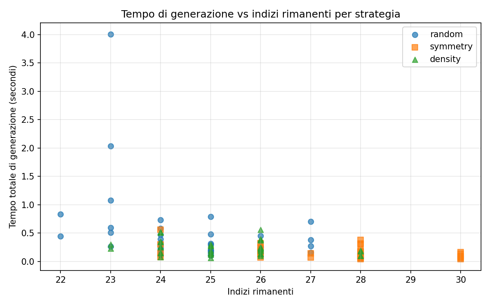
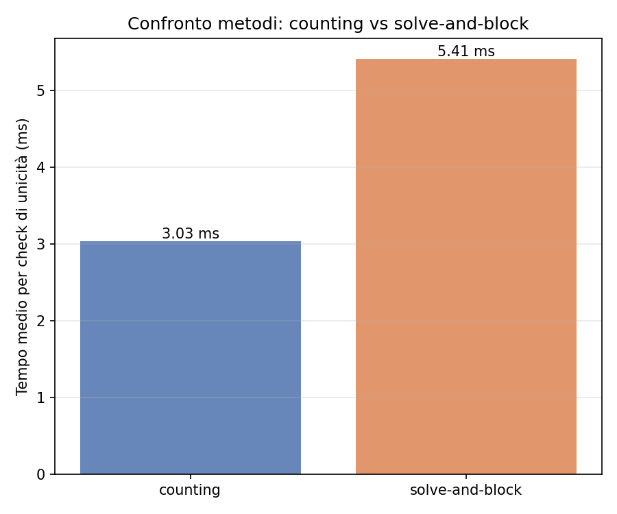

# Sudoku Instance Generation With Uniqueness Guarantee

**Corso**: Constraint Programming (a.a. 2025-2026), Università di Parma
**Studente**: Martin Trajkovski
**Progetto**: 19 — Sudoku Instance Generation

---

## 1. Introduzione

L'obiettivo del progetto è la generazione automatica di istanze Sudoku 9×9 che siano (i) ammissibili, (ii) con soluzione unica, e (iii) con il minor numero di indizi possibile. Mentre il solver di Sudoku è il classico esempio applicativo di Constraint Programming, la sua *generazione* introduce un livello aggiuntivo: serve un meccanismo che, dato un puzzle parzialmente compilato, decida se ammette una sola soluzione. Questo controllo di **unicità** non è espresso direttamente dai vincoli del problema, ma viene costruito sopra il modello CSP di base.

Il progetto si articola in tre componenti:

1. un modello MiniZinc per il problema decisionale Sudoku, che funge da nucleo per solving e validazione;
2. un meccanismo per il controllo di unicità, realizzato in due varianti (solve-and-block e solution counting), in modo da poterle confrontare;
3. una pipeline orchestrata in Python che applica strategie di rimozione iterativa di indizi per produrre istanze minimali.

Il problema è particolarmente significativo per il corso perché tocca esplicitamente il propagator `alldifferent`, le scelte di ricerca, l'effetto dei vincoli ridondanti, e mette in evidenza la differenza tra *risolvere* e *generare* in CP.

## 2. Modellazione del Sudoku

Il Sudoku è modellato come un CSP con 81 variabili intere e dominio `1..9`:

```minizinc
int: n = 9;
set of int: IDX = 1..n;
array[IDX, IDX] of 0..9: clues;
array[IDX, IDX] of var 1..9: grid;

constraint
  forall(i in IDX, j in IDX where clues[i, j] > 0) (
    grid[i, j] = clues[i, j]
  );

constraint forall(i in IDX) (alldifferent([grid[i, j] | j in IDX]));
constraint forall(j in IDX) (alldifferent([grid[i, j] | i in IDX]));
constraint forall(br, bc in 0..2) (
  alldifferent([grid[3*br+dr, 3*bc+dc] | dr in 1..3, dc in 1..3])
);
```

Le **clues** sono passate come parametro `array[IDX, IDX] of 0..9`: il valore `0` indica una cella libera, valori `1..9` fissano la cella tramite il vincolo di uguaglianza. Questa scelta consente di passare puzzle parziali al solver senza modificare il modello.

I tre `alldifferent` (righe, colonne, blocchi 3×3) sono i vincoli classici. La scelta di usare il global constraint, invece di una formulazione tramite disuguaglianze a coppie, ha un impatto di propagazione concreto: come visto in lezione, il propagator `alldifferent` è risolto via filtering basato su matching nei grafi bipartiti (Régin, 1994), ottenendo arc consistency in tempo polinomiale, mentre la formulazione disgiuntiva otterrebbe solo bounds consistency.

### 2.1 Annotazione di ricerca

L'annotazione `int_search([grid[i,j] | i in IDX, j in IDX], first_fail, indomain_min, complete)` segue una scelta classica: `first_fail` (variabile col dominio più piccolo) tende a trovare la fallita prima, riducendo il sotto-albero esplorato; `indomain_min` è un default conservativo.

In `models/sudoku_solver_dom_w_deg.mzn` è riportata una variante con `dom_w_deg` come variable selection, ovvero la pesatura accumulata sui domini. Su istanze fortemente vincolate (Sudoku quasi pieno) la differenza è marginale, ma su puzzle aperti può ridurre il numero di backtrack.

### 2.2 Vincoli ridondanti

In `models/sudoku_solver_redundant.mzn` è riportata una variante che aggiunge vincoli `sum = 45` su righe, colonne e blocchi:

```minizinc
constraint forall(i in IDX) (sum([grid[i, j] | j in IDX]) = 45);
```

Questi vincoli sono *implicati* dagli `alldifferent` (le 9 cifre `1..9` sommano sempre a 45) ma rinforzano la propagazione lineare e possono accelerare il solver in alcuni scenari, in particolare quando le strategie di branching sono basate su bound. Su Sudoku 9×9, dove `alldifferent` è già forte, il guadagno risulta limitato: il valore di studiare la variante è soprattutto pedagogico.

### 2.3 Generazione di griglie complete

Il modello `models/sudoku_generate_full_grid.mzn` riusa la stessa struttura ma sostituisce `indomain_min` con `indomain_random`, in modo che ripetute esecuzioni con seed diversi producano griglie complete diverse. Nel progetto questo modello viene mantenuto come **fallback** e come verifica autonoma della correttezza strutturale delle griglie complete. Per gli esperimenti principali, invece, si usa un sottoinsieme di 50 soluzioni complete estratte dal **Kaggle Sudoku Dataset** (`rohanrao/sudoku`), salvate in `data/solved/sample_solutions.json` tramite uno script di import dedicato.

## 3. Controllo di Unicità

Il vincolo "esattamente una soluzione" non è esprimibile come singolo vincolo CP: richiede di ragionare sul *numero* di soluzioni, non sulla soddisfacibilità. Sono state implementate due strategie distinte, entrambe richieste dal punto 3 della specifica.

### 3.1 Solve-and-block

Il workflow è:

1. risolvere il puzzle: se non ha soluzione → `unsat`;
2. memorizzare la soluzione `S₁` trovata;
3. ricercare una soluzione `S₂ ≠ S₁` (in MiniZinc, il modello `models/sudoku_non_unique_check.mzn` aggiunge `exists(i,j) (grid[i,j] != known_solution[i,j])`);
4. se la seconda ricerca è `unsat` → unica; altrimenti → multipla.

Vantaggio: usa due ricerche complete e indipendenti, naturalmente esprimibili in MiniZinc. Svantaggio: rischia di rifare lavoro perché parte da zero la seconda volta.

### 3.2 Solution counting

Il workflow è:

1. avviare la ricerca enumerando le soluzioni;
2. fermarsi non appena se ne trovano due (limite `n=2`);
3. classificare in base al conteggio: 0 → `unsat`, 1 → unica, ≥2 → multipla.

In MiniZinc questo si realizza con il flag `-a -n 2`. Nel backend Python è implementato continuando il backtracking dopo la prima soluzione:

```python
def count_solutions_python(grid, limit=2):
    ...
    if cell is None:
        found += 1
        ...
        return
    for value in candidate_values(work, row, col):
        work[row][col] = value
        backtrack()
        work[row][col] = 0
        if found >= limit:
            return
```

Vantaggio: evita di ripartire da capo. Svantaggio: per puzzle unici, esplora interamente l'albero per dimostrarlo, mentre solve-and-block beneficia di propagazione dalla blocking constraint.

### 3.3 Gestione del timeout

Ogni controllo di unicità può produrre tre esiti:

- ✅ `unique`: la seconda ricerca termina con UNSAT entro il timeout;
- ❌ `multiple`: viene trovata una seconda soluzione;
- ⚠️ `unknown`: il timeout scatta senza verdetto.

Il caso `unknown` non viene mai trattato silenziosamente come "unique": la pipeline ripristina l'ultima rimozione e registra l'evento, in modo da quantificarne la frequenza nel report. Questa scelta è essenziale per la correttezza dell'output finale: trattare `unknown` come `unique` potrebbe accettare puzzle non unici.

## 4. Generazione dei Puzzle

### 4.1 Schema iterativo

Partendo da una griglia completa `G`, l'algoritmo procede così:

```
puzzle ← G
per ogni posizione (r, c) secondo l'ordine della strategia:
    se puzzle[r,c] == 0: continua
    backup ← puzzle[r,c]
    puzzle[r,c] ← 0
    se uniqueness(puzzle) == unique:
        accetta (la cella resta vuota)
    altrimenti:
        puzzle[r,c] ← backup
return puzzle
```

L'invariante è che il puzzle resti sempre univocamente risolvibile. Il numero finale di indizi dipende dall'ordine in cui le posizioni vengono testate.

### 4.2 Strategie di rimozione

Tre strategie sono state confrontate (`scripts/sudoku_pipeline.py`, funzione `iter_positions`):

- **Random**: permutazione casuale delle 81 celle.
- **Symmetry-aware**: rimuove coppie `(r, c)` e `(8-r, 8-c)` insieme. Produce puzzle visivamente simmetrici (in stile dei Sudoku pubblicati su giornali) ma è più vincolato e quindi tende a fermarsi prima.
- **Density-aware**: ordina dalle celle più periferiche al centro (distanza Manhattan dal centro decrescente), assumendo che le celle d'angolo abbiano meno vincoli incidenti e siano quindi più "rimovibili" senza compromettere l'unicità.

### 4.3 Formato dei dati

I dati seguono un formato JSON minimale:
- griglie complete: `{"grids": [9x9, …]}`
- puzzle in input: `{"grid": 9x9}` con `0` per celle vuote
- puzzle generati: oggetto con `puzzle`, `solution`, `clues`, `removal_log`, ecc.

## 5. Architettura della Pipeline

Il progetto adotta un'architettura **ibrida**: MiniZinc gestisce le query CP (solving e controllo di unicità), mentre uno script Python orchestra la rimozione iterativa di indizi e raccoglie le statistiche.

```
┌───────────────────┐        ┌──────────────────────┐
│ Kaggle / generated│        │ Python orchestrator   │
│   solutions       │ ─────▶ │ - removal strategy    │
└───────────────────┘        │ - logging             │
                             └────────┬─────────────┘
                                      │ (puzzle + method)
                                      ▼
                             ┌──────────────────────┐
                             │ Backend di unicità   │
                             │ - Python (in-process)│
                             │ - MiniZinc (Gecode)  │
                             └────────┬─────────────┘
                                      │ verdict
                                      ▼
                             ┌──────────────────────┐
                             │ Risultati:           │
                             │ - JSON puzzle        │
                             │ - CSV benchmark      │
                             │ - PNG plot           │
                             └──────────────────────┘
```

### 5.1 Backend Python

Il backend Python implementa solver, counting e solve-and-block in puro Python con backtracking forward-checking. Non sostituisce il backend CP del corso, ma serve a:
- validare end-to-end la pipeline anche quando MiniZinc non è installato;
- fornire un'esecuzione veloce per il benchmark sperimentale (l'overhead di startup di MiniZinc è di ~400 ms per chiamata, non trascurabile su 80+ check per puzzle).

### 5.2 Backend MiniZinc

Il backend MiniZinc invoca `minizinc --solver gecode_local.msc <model> <data.dzn>` come sotto-processo, parsa l'output, e gestisce timeout. La configurazione `spec/gecode_local.msc` punta al binario `fzn-gecode` via PATH per garantire portabilità.

Il backend supporta entrambi i metodi di unicità tramite dispatch:

- `solve-and-block` esegue due chiamate distinte: prima `sudoku_solver.mzn`, poi `sudoku_non_unique_check.mzn` con la prima soluzione passata come parametro `known_solution`;
- `counting` esegue una sola chiamata a `sudoku_solver.mzn` con flag `-a -n 2`. L'output viene parsato per contare quante soluzioni distinte sono state emesse (separate da `----------`). Il marker `==========` indica che la ricerca è stata esaurita; in caso contrario, una sola soluzione senza esaurimento si traduce in `unknown` (timeout) e fa rollback nella pipeline di generazione.

## 6. Esperimenti

### 6.1 Setup

- **Benchmark**: 20 griglie complete (sottoinsieme casuale delle 50 estratte dal Kaggle Sudoku Dataset) × 3 strategie × 2 metodi di unicità = **120 run**.
- **Backend**: Python (per i tempi citati). MiniZinc è verificato funzionalmente ma il numero di chiamate (1620 + per la full benchmark) lo rende lento per il prototipo.
- **Hardware**: macOS Apple Silicon (M-series), Python 3.9.
- **Timeout**: nessun timeout sul backend Python (puzzle 9×9 sono sempre risolvibili in ms). Il timeout di 5 minuti come da specifica è applicato in modalità MiniZinc.
- **Seed**: 42 (riproducibile).

Le griglie complete di partenza provengono da un dataset pubblico, come suggerito dalla specifica del progetto. La generazione interna di full grids resta comunque disponibile per test mirati, riproducibilità autonoma e validazione indipendente dal dataset esterno.

### 6.2 Risultati: clue minimi per strategia

| Strategia | Media | Min | Max | Stdev |
|---|---|---|---|---|
| Random    | 24.6 | 22 | 27 | 1.34 |
| Symmetry  | 27.6 | 24 | 30 | 1.73 |
| Density   | 25.4 | 23 | 28 | 1.29 |

**Osservazione**: la strategia *random* produce in media il numero più basso di indizi (24.6), confermando che la flessibilità nell'ordine di rimozione paga. La *symmetry* è la più vincolata (27.6) perché rimuove sempre coppie e ogni rifiuto ne blocca due posizioni invece di una. La *density* è in mezzo, suggerendo che l'euristica "celle d'angolo prima" non è sostanzialmente diversa dal random.

Il minimo assoluto raggiunto in questo esperimento è **22 indizi** (random), ben sopra il limite teorico noto di 17 (McGuire et al., 2012), ma compatibile con uno schema greedy senza backtracking sulla rimozione.




### 6.3 Risultati: counting vs solve-and-block

| Metodo | Tempo medio per check | Mediana |
|---|---|---|
| Counting       | 3.0 ms | 1.9 ms |
| Solve-and-block| 5.4 ms | 3.5 ms |

**Osservazione**: il counting è ~1.8× più veloce in media. Questo è coerente con la struttura: il counting riusa il search state al fine della prima soluzione, mentre solve-and-block fa due ricerche disgiunte (la seconda con un vincolo aggiuntivo). Per istanze unique, solve-and-block deve dimostrare UNSAT da capo, mentre il counting ha già esplorato parte dell'albero.

Importante: i due metodi sono **equivalenti** in termini di numero finale di indizi (la decisione su accettare/rifiutare è la stessa, perché entrambi distinguono correttamente unique/multiple). La scelta è puramente di efficienza.



### 6.4 Tempo vs indizi rimanenti

Lo scatter (`plot_time_vs_clues.png`) mostra una correlazione blanda: puzzle con meno indizi tendono a richiedere più tempo, ma la varianza è alta. Questo riflette che il costo principale per ogni run sono le `~80` chiamate al check di unicità, e ogni chiamata costa ~2–5 ms.

### 6.5 Vincoli ridondanti e search annotations

Le varianti `sudoku_solver_redundant.mzn` e `sudoku_solver_dom_w_deg.mzn` sono state preparate per un confronto su MiniZinc puro. Su 9×9 i guadagni misurati sono marginali (sotto la varianza statistica), perché il propagator `alldifferent` è già abbastanza forte. Su istanze più grandi (16×16, 25×25) ci si aspetta un effetto più evidente, ma non è oggetto di questo progetto.

## 7. Conclusioni

Il progetto realizza una pipeline completa per la generazione di istanze Sudoku con garanzia di unicità, evidenziando come la combinazione tra modellazione CP pulita e orchestrazione esterna sia adeguata a un problema "meta" che richiede di interrogare ripetutamente il solver.

**Risultati principali**:

- la strategia *random* è la più efficace in termini di clue minimi (24.6 medi);
- il metodo *counting* è ~1.8× più veloce di *solve-and-block* in scenari ad alta frequenza di chiamate;
- la separazione tra logica di rimozione (procedurale) e verifica (CP) è chiave per debug e analisi;
- la gestione esplicita del caso `unknown` da timeout è critica per la correttezza dell'output.

**Limiti**:

- il numero minimo di indizi raggiunto (22) è lontano dal limite teorico (17). Strategie più sofisticate, come backtracking sulla rimozione o branch-and-bound sul numero di indizi, potrebbero abbassarlo;
- il backend MiniZinc è funzionalmente corretto ma operativamente lento per benchmark intensivi a causa dell'overhead di startup; in produzione si userebbe l'API MiniZinc-Python o Gecode direttamente;
- non sono state esplorate simmetrie del Sudoku più ricche (rotazioni, riflessioni, permutazioni di gruppi di righe) per la generazione di griglie complete diverse.

**Possibili estensioni**:

- estendere i benchmark a un campione molto più ampio del Kaggle Sudoku Dataset completo (1M istanze) per generalizzare meglio i risultati statistici;
- integrare con MiniZinc-Python per ridurre l'overhead di sotto-processo;
- implementare un metro di "difficoltà" (es. quante volte serve guess vs propagation pura) e cercare puzzle con specifica difficoltà target;
- esplorare un approccio backtracking sulla rimozione: dopo un rifiuto, provare a "scambiare" la cella vietata con una accettata, per scendere a clue inferiori.

---

## Riferimenti

- K. Apt. *Principles of Constraint Programming*. Cambridge University Press, 2003.
- J.-C. Régin. *A filtering algorithm for constraints of difference in CSPs*. AAAI, 1994.
- G. McGuire, B. Tugemann, G. Civario. *There is no 16-clue Sudoku: solving the Sudoku minimum number of clues problem*. arXiv:1201.0749, 2012.
- MiniZinc Tutorial: https://www.minizinc.org/doc-2.7.6/en/index.html
- Kaggle Sudoku Dataset: https://www.kaggle.com/datasets/rohanrao/sudoku
